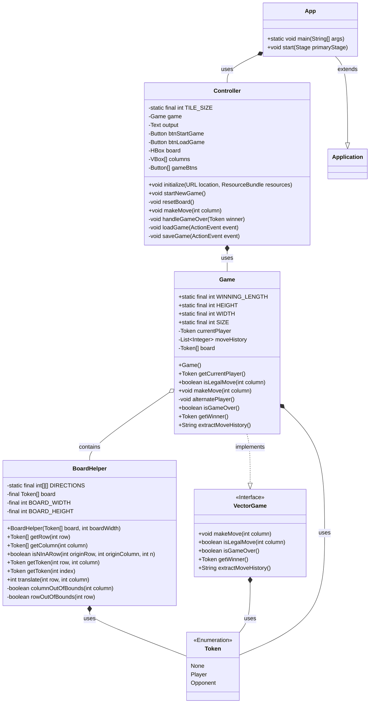

# Connect4 in JavaFX | TDT4100 - OOP

Connect4 implemented in JavaFX is my project for the subject of Object-Oriented-Programming at NTNU.

## Requirements

-   [x] Minimum 2 self-implemented classes
    -   [x] Minimum 1 class for calculation. Can be: game logic, math calculation, etc...
    -   [x] Minimum 1 class has to implement a self-made or pre-existing interface (Iterable, Comparable)
-   [x] All classes requires complete encapsulation and validation if necessary
-   [x] The app requires a user interface in JavaFX with corresponding Controller and App classes. These do not count for the minimum requirement of 2 self-implemented classes.
-   [x] The app requires the functionality to read and write from files.
-   [x] The app requires appropriate error handling
-   [x] JUnit-tests shall be used to test functionality of the app
-   [x] Documentation is required.
    -   [x] Code shall be documented. (Comments in code should answer why decisions were made as they were)
    -   [x] It shall explain how the app works.
    -   [x] How the project fulfills requirements shall be explained. Use relevant phrases and terminology to the subject.

## Project planning

### App description

Connect4 is a turn-based boardgame played between 2 players where you win if you line up 4 pieces in a row, horizontally, vertically or diagonally.
The goal of this application is to create a playable game of Connect4 with correct underlying game logic and an interactive Graphical User Interface (GUI) for playing moves.

### Class descriptions - TODO

Game klassen implementerer VectorGame og bruker Token til å fylle brettet sitt.
Game klassen skal kalkulere og validere spilllogikken.

### File handling

Spillere skal kunne lagre et Fire-på-rad spill som en fil og kunne laste det inn igjen.

### Testing

Spilllogikk og filhåndtering blir testet.
Fokuset vil være på å teste interfacet Game implementerer som Controller bruker.

## Documentation

### Description

Vår app, Connect4, er en digital versjon av det kjente brettspillet fire på rad, hvor to spillere konkurrerer om å være den første til å få fire av sine brikker på rad, enten i kryss eller på tvers. Appen vår omfatter til sammen fire klasser, et interface, og ett enum.

Hjertet av applikasjonen, som sett i diagrammet under, ligger `Game`-klassen. `Game`-klassen håndterer selve spillet, dvs. å starte spillet, prosessere trekk, og avgjøre seire. `BoardHelper`-klassen støtter med nødvendige funksjoner for å f.eks. sjekke gyldigheten av trekk og identifisere om noen har vunnet. Brikker, representert av `Token`-enumet, kommuniserer om brikken er spillerens, motstanderens, eller tom.

Brukergrensesnittet og spillinteraksjonen håndteres gjennom `App`- og `Controller`-klassene, som fungerer som broen mellom brukergrensesnittet og spillets logikk.

`Game`-klassen implementerer `VectorGame`-interfacet, som bla.a. krever at klassen har en metode for å hente spilleren som skal gjøre neste trekk. Dette gjør det oversiktlig og enkelt for `App`- og `Controller`-klassene å hente informasjon om spillet.

For å sikre at appen funker slik den skal, har vi omfattende enhetstester i `GameTest` og `BoardHelperTest`. Målet er å teste flest mulige scenarioer for å bla.a. sikre at ingen ugylige trekk kan gjøres, og at spillet alltid kan avgjøre en vinner.

### Diagram

### Questions

1. Hvilke deler av pensum i emnet dekkes i prosjektet, og på hvilken måte? (For eksempel bruk av arv, interface, delegering osv.)

Vi tar i bruk abstraksjon ved å implementere klasser som innkapsler data og oppførsel relatert til dataen,
som for eksempel med Game klassen som er en Fire-på-rad runde.
Med dette trenger ikke brukere av denne klassen sette seg inn i implementasjonen til klassen, bare oppførselen.

Innkapsling og validering blir tatt i bruk i alle klasser for å passe på at all mutasjon av data blir håndtert og validert av sin egen klasse.

Delegering tatt mye i bruk i og med at `Controller` validerer sine hendelser og kaller `Game` sine metoder for å oppdatere Game state.

2. Dersom deler av pensum ikke er dekket i prosjektet deres, hvordan kunne dere brukt disse delene av pensum i appen?

Arv kunne blitt tatt i bruk ved å lage en `Board` klasse og fått `Game` til å arve fra `Board` siden `Game` er en type brettspill.
Men vi ser ingen fordel ved dette over å bare la `Game` heller implementere et `Board` interface.
Arv i moderne tid er som regel sett på som dårlig praksis med få bruksområder der arv er gunstig uten å skape teknisk gjeld med forvirrende kode.

Polymorfisme blir tatt i bruk ved å definere grensesnittet `VectorGame`. `Game` er da bare en Fire-på-rad implementasjon av `VectorGame` og en kan i teorien implementere et annet spill med lignende form som Fire-på-rad og bruke det samme brukergrensesnittet for å spille med nye regler.

Istedenfor at `Controller` kaller `Game` for å sjekke om spillet er ferdig etter hvert trekk,
kunne vi brukt Observatør-Observert design mønstret slik at `Game` gir beskjed til `Controller` når spillet er ferdig.
Så kunne `Controller` håndtert denne hendelsen og oppdatert brukergrensesnittet.

3. Hvordan forholder koden deres seg til Model-View-Controller-prinsippet? (Merk: det er ikke nødvendig at koden er helt perfekt i forhold til Model-View-Controller standarder. Det er mulig (og bra) å reflektere rundt svakheter i egen kode)

Koden vår forholder seg til MVC mønstret ved å definere mesteparten av View i .fxml filer.
Spilllogikk og tilstand blir håndtert hovedsakelig av `Game` klassen, mens `Controller` binder brukergrensesnittet og logikken sammen.
`Controller` kaller `Game` for å oppdatere spilltilstanden,
så oppdateres grensesnittet.
Basert på validering av trekk håndterer `Controller` grensesnittet slik at det ikke er mulig å utføre ulovlige trekk.

Et mulig avvik i MVC mønstret skjer når selvet brettet blir skapt.
Statiske elementer i grensesnittet ligger i `App.fxml` filen,
mens spillbrettet blir dynamisk generert basert på tilstanden til `Game`.
Dette krever at `App.fxml` er lastet inn,
for så at `Controller` opprettes og har tilgang til ruten spillbrettet skal bli opprettet.
Dette er ikke nødvendigvis et avvik,
men det er verdt å bemerke.

4. Hvordan har dere gått frem når dere skulle teste appen deres, og hvorfor har dere valgt de testene dere har? Har dere testet alle deler av koden? Hvis ikke, hvordan har dere prioritert hvilke deler som testes og ikke? (Her er tanken at dere skal
   reflektere rundt egen bruk av tester)

Måten vi har gått frem med testing er å skrive tester til slutt siden vi ikke viste hvordan klasser og metoder kom til å se ut i sluttproduktet.
Ettersom vi begynte å se sluttformen på spillet kunne vi begynne å skrive tester for å passe på at oppførselen ikke endrer seg.
Dette gjorde det enklere å refaktorere implementasjonen for mer forståelig kode.

Vi har valgt å hovedsakelig fokusere på testing av grensesnittet (`VectorGame`interface) til `Game`.
Dette er grensesnittet `Controller` tar i bruk for å oppdatere spillets tilstand,
dermed vet vi til en viss grad at hvis grensesnittet `VectorGame` funker,
trenger vi ikke å teste implementasjonen `Game`.

## Credits

<a href="https://www.flaticon.com/free-icons/joystick" title="joystick icons">Joystick icons created by Us and Up - Flaticon</a>
