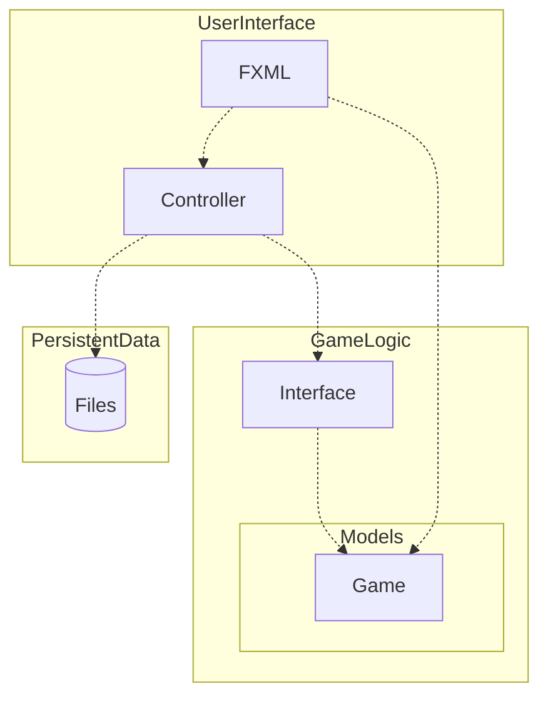

# Connect4 in JavaFX | TDT4100 - OOP

Connect4 implemented in JavaFX is my project for the subject of Object-Oriented-Programming at NTNU.

## Requirements

- [ ] Minimum 2 self-implemented classes
  - [ ] Minimum 1 class for calculation. Can be: game logic, math calculation, etc...
  - [ ] Minimum 1 class has to implement a self-made or pre-existing interface (Iterable, Comparable)
- [ ] All classes requires complete encapsulation and validation if necessary
- [ ] The app requires a user interface in JavaFX with corresponding Controller and App classes. These do not count for the minimum requirement of 2 self-implemented classes.
- [ ] The app requires the functionality to read and write from files.
- [ ] The app requires appropriate error handling
- [ ] JUnit-tests shall be used to test functionality of the app
- [ ] Documentation is required.
  - [ ] Code shall be documented. (Comments in code should answer why decisions were made as they were)
  - [ ] It shall explain how the app works.
  - [ ] How the project fulfills requirements shall be explained. Use relevant phrases and terminology to the subject.

## Project planning

### App description

Connect4 is a turn-based boardgame played between 2 players where you win if you line up 4 pieces in a row, horizontally, vertically or diagonally.
The goal of this application is to create a playable game of Connect4 with correct underlying game logic and an interactive Graphical User Interface (GUI) for playing moves.

### Functional requirements

Our requirements for this product are as follows:

- [ ] A user or multiple users, shall be able to play a game of chess locally on the same machine where the white and black players alternate playing moves
- [ ] In a chess game, a user shall not be able to play illegal moves
- [ ] A user shall be able to browse the move history of a finished game
- [ ] A user shall be able to import a finished game with a file to browse
- [ ] A user shall be able to export a finished game to store or share

### Class descriptions - TODO

> Fortelle kort hva de to (minimum to, kan ha flere) grunnklassene skal inneholde, og hvilken klasse som skal ha noen form for kalkulasjoner eller annen logikk.

### File handling

A user shall be able to import and export chess games as `.pgn` files.

### Testing

General game logic like checking for illegal moves shall be tested, as well as importing and exporting of `.pgn` files.

## Documentation - TODO

### Description - TODO

### Diagram - TODO

### Questions - TODO

## Credits

<a href="https://www.flaticon.com/free-icons/joystick" title="joystick icons">Joystick icons created by Us and Up - Flaticon</a>
