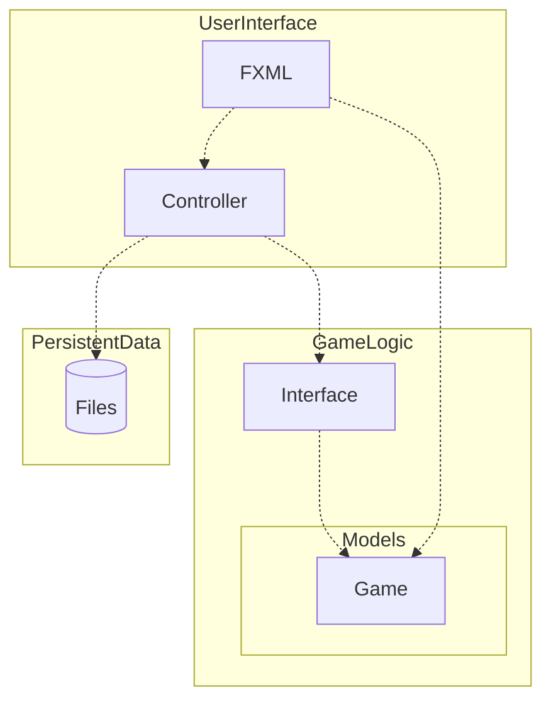

# Connect4 in JavaFX | TDT4100 - OOP

Connect4 implemented in JavaFX is my project for the subject of Object-Oriented-Programming at NTNU.

## Requirements

-   [x] Minimum 2 self-implemented classes
    -   [x] Minimum 1 class for calculation. Can be: game logic, math calculation, etc...
    -   [x] Minimum 1 class has to implement a self-made or pre-existing interface (Iterable, Comparable)
-   [ ] All classes requires complete encapsulation and validation if necessary
-   [x] The app requires a user interface in JavaFX with corresponding Controller and App classes. These do not count for the minimum requirement of 2 self-implemented classes.
-   [x] The app requires the functionality to read and write from files.
-   [x] The app requires appropriate error handling
-   [x] JUnit-tests shall be used to test functionality of the app
-   [x] Documentation is required.
    -   [x] Code shall be documented. (Comments in code should answer why decisions were made as they were)
    -   [x] It shall explain how the app works.
    -   [ ] How the project fulfills requirements shall be explained. Use relevant phrases and terminology to the subject.

## Project planning

### App description

Connect4 is a turn-based boardgame played between 2 players where you win if you line up 4 pieces in a row, horizontally, vertically or diagonally.
The goal of this application is to create a playable game of Connect4 with correct underlying game logic and an interactive Graphical User Interface (GUI) for playing moves.

### Functional requirements

Our requirements for this product are as follows:

-   [x] A user or multiple users, shall be able to play a game of chess locally on the same machine where the white and black players alternate playing moves
-   [x] A user shall not be able to play illegal moves
-   [ ] A user shall be able to browse the move history of a finished game
-   [x] A user shall be able to import a finished game with a file to browse
-   [x] A user shall be able to export a finished game to store or share

### Class descriptions - TODO

> Fortelle kort hva de to (minimum to, kan ha flere) grunnklassene skal inneholde, og hvilken klasse som skal ha noen form for kalkulasjoner eller annen logikk.

### File handling

A user shall be able to import and export chess games as `.pgn` files.

### Testing

General game logic like checking for illegal moves shall be tested, as well as importing and exporting of `.pgn` files.

## Documentation - TODO

### Description - TODO

Vår app, Connect4, er en digital versjon av det kjente brettspillet fire på rad, hvor to spillere konkurrerer om å være den første til å få fire av sine brikker på rad, enten i kryss eller på tvers. Appen vår omfatter til sammen fire klasser, et interface, og ett enum.

Hjertet av applikasjonen, som sett i diagrammet under, ligger `Game`-klassen. `Game`-klassen håndterer selve spillet, dvs. å starte spillet, prosessere trekk, og avgjøre seire. `BoardHelper`-klassen støtter med nødvendige funksjoner for å f.eks. sjekke gyldigheten av trekk og identifisere om noen har vunnet. Brikker, representert av `Token`-enumet, kommuniserer om brikken er spillerens, motstanderens, eller tom.

Brukergrensesnittet og spillinteraksjonen håndteres gjennom `App`- og `Controller`-klassene, som fungerer som broen mellom brukergrensesnittet og spillets logikk.

`Game`-klassen implementerer `VectorGame`-interfacet, som bla.a. krever at klassen har en metode for å hente spilleren som skal gjøre neste trekk. Dette gjør det oversiktlig og enkelt for `App`- og `Controller`-klassene å hente informasjon om spillet.

For å sikre at appen funker slik den skal, har vi omfattende enhetstester i `GameTest` og `BoardHelperTest`. Målet er å teste flest mulige scenarioer for å bla.a. sikre at ingen ugylige trekk kan gjøres, og at spillet alltid kan avgjøre en vinner.

### Diagram - TODO

### Questions - TODO

## Credits

<a href="https://www.flaticon.com/free-icons/joystick" title="joystick icons">Joystick icons created by Us and Up - Flaticon</a>
